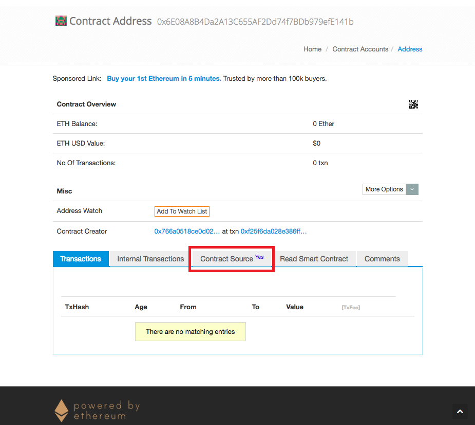
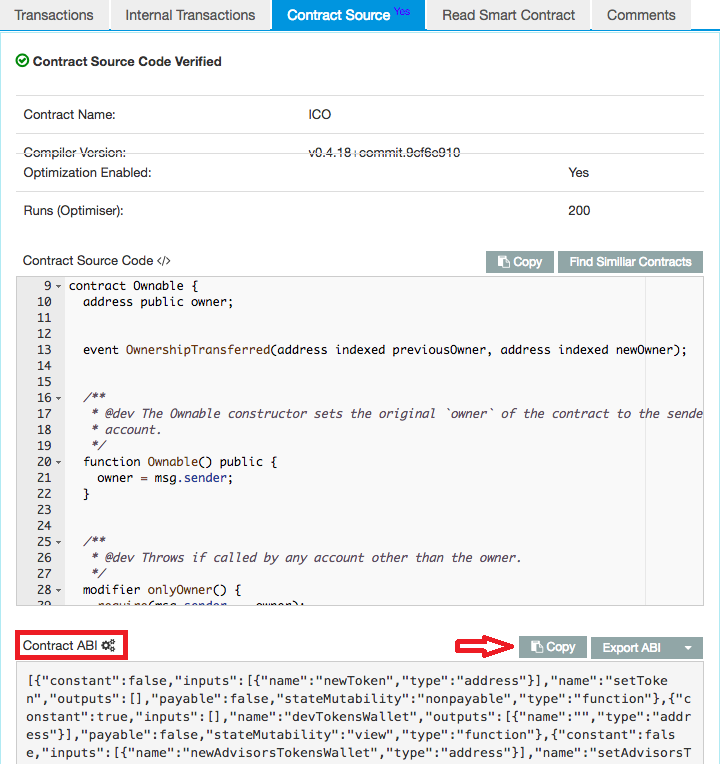
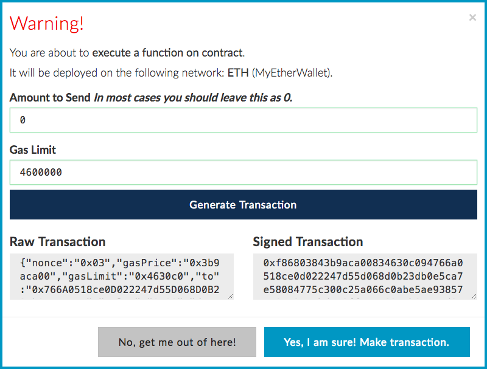
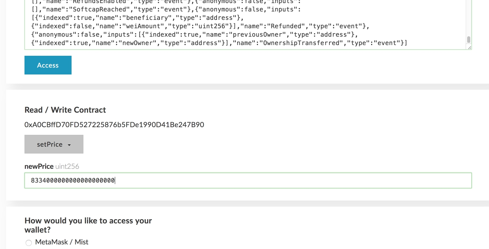
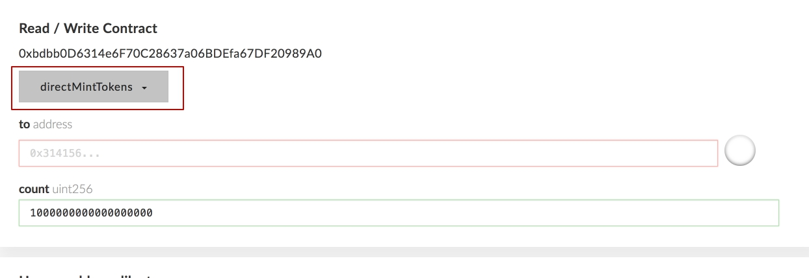

# Основы работы со смарт-контрактом

## Взаимодействие со смарт-контрактом
Взаимодействие со смарт-контрактом происходит посредством вызова функций контракта с указанием параметров.
Для взаимодействия необходимо знать адрес смарт-контракта.
На основе адреса нужно получить ABI-интерфейс.
По ABI интерфейсу можно вызвать целевую функцию.  
Функцию на запись может вызвать только владелец смарт-контракта. В нашем случае, это кошелек с адресом 0xf51e0a3a17990d41c5f1ff1d0d772b26e4d6b6d0.

## Получение ABI интерфейса
Для получения интерфейса вам необходимо:
* Открыть https://etherscan.io

* В правом верхнем углу в окне с надписью «search by address» ввести адрес целевого смарт-контракта и нажать «go»

* Нажать на вкладку «contract source»:
  

Скриншот

  

  

* Найти поле с надписью «Contract ABI» и нажать на кнопку «copy» справа от надписи
  

Скриншот

  

  

* Интерфейс ABI контракта теперь скопирован в буфер обмена.

## Вызов функции
* Откройте кошелек https://www.myetherwallet.com

* Выберите вкладку «контракты» и заполните поля «Адрес контракта» и «ABI/JSON интерфейс» (его мы получили в предыдущей части инструкции). Нажмите на кнопку «подключиться».
  

Скриншот

  

  

* После этого нам станет доступен список функций контракта. Выбирите целевую функцию и заполните параметры.
  

Скриншот

  

  

* После выбора функции и заполнения параметров получите доступ к кошельку-владельцу смарт-контракта удобным вам способом и нажмите на кнопку «записать».
  

Скриншот

  

  

* Далее нажмите на кнопку «Да, я уверен, выполнить транзакцию».
  

Скриншот

  

  

>Внимание! Перед тем как нажать «записать» внимательно проверьте введенные данные. Часто формат данных отличается от привычного пользователю вида.

* После этого внизу появится зеленая панель со ссылкой «Verify transaction». Нажмите на эту ссылку, чтобы открыть страницу с информацией о транзакции в Etherscan. Ждите окончания выполнения транзакции.

## Как изменить стоимость токена
В каждом из контрактов распродажи (Presale и Mainsale) имеется фукция setPrice(newPrice), предназначенная для установки количества токенов, получаемых за 1 ETH.

Скриншот

Функция принимает один параметр:
* «newPrice» - количество токенов, получаемых за 1 ETH.

>Внимание!
1. Функция устанавливает не цену токена, а отношение токенов к эфиру.  
Таким образом, если токен стоит 0.0002 ETH, то формула будет такая: 1 / 0.0002 = 5000.
2. К полученному числу нужно добавить 18 нулей.
Т.е, если мы хотим получить 5000 LCCT за 1 ETH, то мы должны передать в виде параметра число 5000000000000000000000
3. Для того, чтобы получить скидку в 40% при базовой стоимости токена в 0.0002 ETH, мы должны передать в функцию 1 / (0.0002 \* 0.6) * 10^18 ~ 8334000000000000000000
3. Для того, чтобы получить скидку в 30% при базовой стоимости токена в 0.0002 ETH, мы должны передать в функцию 1 / (0.0002 \* 0.7) * 10^18 ~ 7143000000000000000000

## Как воспользоваться функцией ручного выпуска токенов
В каждом из контрактов распродажи (Presale и Mainsale) доступны две функции для ручного выпуска токенов:

* directMintTokens(to, count) - данная функция предназначена для непосредственного выпуска токенов.  
  

Скриншот

  

  

Принимает два параметра:  
  * «to» - адрес кошелька инвестора, на чей счет выпускаются токены
  * «count» - количество токенов, которое нужно выпустить

>Внимание! Как и в ситуации с ценой, для того, чтобы получить 1 LCCT нужно умножить 1 на 10^18 (указать в поле «count» 1000000000000000000)

* directMint(to, investedWei) - данная функция предназначена для выпуска токенов с автоматическим расчетом количества, в зависимости от даты и времени выполнения транзакции и суммы эфира, указанной в поле «investedWei».
  

Скриншот

  

  

Принимает два параметра:  
  * «to» - адрес кошелька инвестора, на чей счет выпускаются токены
  * «investedWei» - количество эфира, на основании которого будет производиться автоматический расчет (начисляться бонус, в зависимости от даты и времени выполнения транзакции)

>Внимание! Сумма «invested» указывается не в ETH, а в Wei. Это в 18 раз меньше, чем ETH.  
Для того, чтобы выпустить токены на сумму в 1 ETH, мы должны в поле «invested» указать «1000000000000000000» (18 нулей).

## Как изменить дату начала распродажи
В каждом из контрактов распродажи (Presale и Mainsale) имеется фукция setStart(newStart), предназначенная для установки даты начала распродажи.
Функция принимает один параметр:
* «newStart» - время в формате unix time

>Внимание! Unix time - это количество секунд, прошедших с полуночи (00:00:00 UTC) 1 января 1970 года. Для того, чтобы узнать, как выглядит дата в формате unix time, воспользуйтесь онлайн-конвертером.  
Не забудьте учесть часовой пояс, в котором вы находитесь, т.к. дата указывается относительно Гринвичского меридиана (GMT +0).

## Как посмотреть интерфейс смарт-контракта
* Открыть https://etherscan.io
* В правом верхнем углу в окне с надписью «search by address» ввести адрес целевого смарт-контракта и нажать «go»
* В открывшейся странице нажать на вкладку «Read smart contract»
  

Скриншот

  

  

## Памятка владельцу смарт-контрактов
Владелец смарт-контрактов должен после каждой распродажи вызвать функцию finish() у соответствующего смарт-контракта распродажи. А именно:
* По окончанию распродажи у контракта Presale вызвать finish()  
адрес контракта: 0xbdbb0d6314e6f70c28637a06bdefa67df20989a0
* По окончанию распродажи у контракта ICO вызвать finish()  
адрес контракта: 0x33ee4dbe891859811958c43e05c09cff084b0a03
* Перед вызовом убедитесь, что адрес контракта соответствует текущей распродаже!
